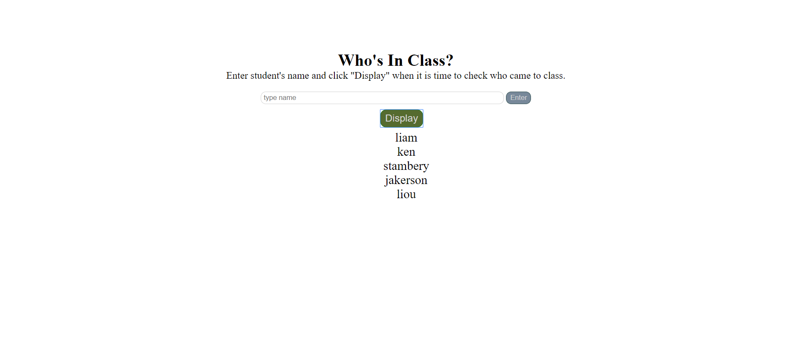

# 👩🏾‍🎓 List of Students

Javascripted a form that takes in an array of students and displays them back into the DOM. Every display updates the list.

### How It's Made:

**languages used:** jquery, HTML5, CSS3,

All jquery. Made an event listener for each button, one to take in the values entered into the input and the other button function displays the values into the DOM. Every name entered is made into an array and the array later is displayed.

## Lessons Learned:

Learned a few interesting array methods.
